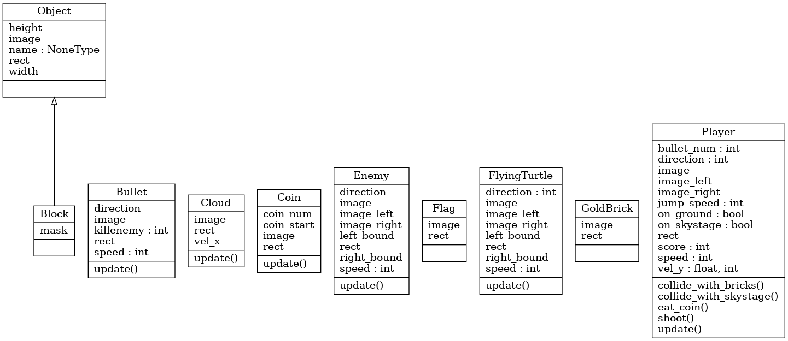

# Game Demo


# Class Diagram of main program


# If you're first time using docker 
First open the terminal and type
```
$ sudo groupadd -f docker
```
Then type the following usermod command to add the active user to the **docker** group
```
$ sudo usermod -aG docker $USER
```
Apply the group changes to the current terminal session by typing
```
$ newgrp docker
```
Finally check if the **docker** group is in the list of user groups
```
$ groups
```

# How to run the game
首先進入docker
```
$ source Docker/docker_run.sh
```
進入docker後輸入下列指令即可進入遊戲:
```
# source require.sh
```
```
# python3 main.py
```
若出現ALSA相關問題可嘗試輸入
```
# aplay -l
```
看是否有正確安裝並識別音訊設備

若音訊設備已正確安裝並被偵測到，輸入
```
# export AUDIODEV=hw:2,0
```
```
# speaker-test -D hw:2,0 -t wav -c 2
```
測試聲音，有聲音的話就可以ctrl-c結束並執行遊戲
```
# python3 main.py
```