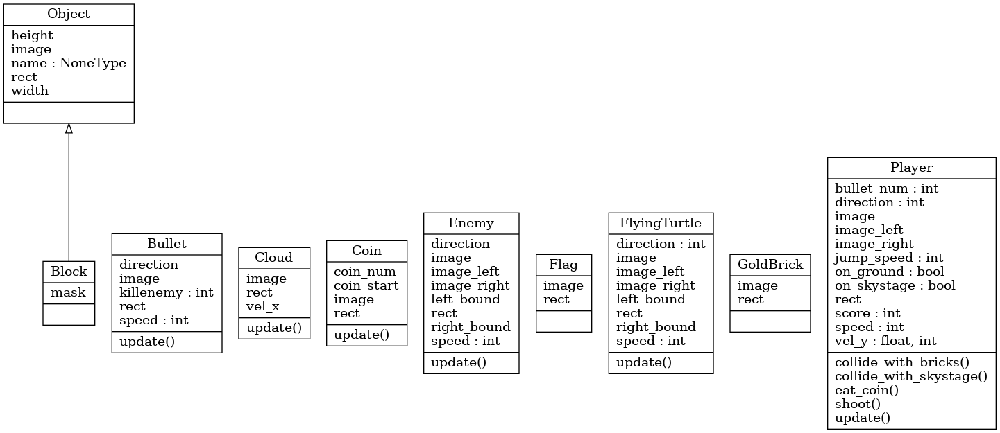
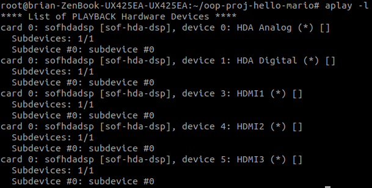

# Game Demo


# Class Diagram of main program


# Tasks before running the game
1. Create a **Docker Hub account**.
2. Log in your docker hub and create a new repository to store the built images.
3. Enter ~/oop-proj-hello-mario/Docker and modify ```build.sh``` and ```docker_run.sh```
4. If you're the team leader, enter your own docker hub account and repository. Do it for both ```build.sh``` and ```docker_run.sh```.
5. If you're a team member, enter your team leader's docker hub account, repository and tag name **ONLY** in the ```docker_run.sh```

| Identity | Leader | Member |
| -------- | ------ | ------ |
| `build.sh` | Leader user name, repository name | X (have to wait for leader to build the image) |
| `docker_run.sh` | Leader user name, repository name | Leader user name, repository name |
| `docker_join.sh` | Leader user name, repository name | Leader user name, repository name |


# Use Docker As Root
First open the terminal and type
```
$ sudo groupadd -f docker
```
Then type the following usermod command to add the active user to the **docker** group
```
$ sudo usermod -aG docker $USER
```
Apply the group changes to the current terminal session by typing
```
$ newgrp docker
```
Finally check if the **docker** group is in the list of user groups
```
$ groups
```

# How to run the game
First enter the repo
```
$ cd oop-proj-hello-mario
```
Build the docker image first (team leader only)
```
./docker_build
```
The process requires docker hub account. There will be messages about loggin in to docker hub account before you build the image.

After the images is built and pushed to docker hub, both team leader and member can run
```
$ ./docker_run
```
If the docker container is in process, please run
```
$ ./docker_join
```
Run this command to enter the game after the container is running
```
# python3 main.py
```
# Audio Device issue handling
This game requires your audio device. The default is set to `hw:0,0` beforehand.

If there are any error messages related to `ALSA`, please run the following command:
```
# aplay -l
```
This command shows all your available audio devices.

If you have an available audio device, run the following:
```
# export AUDIODEV=hw:(#card_number),(#device_number)
```
Choose the audio device you want to use from the above list.

e.g.



`HDA Analog` is the name of the laptop, and it's on `card 0`, `device 0`. So we enter
```
# export AUDIODEV=hw:0,0
```
Test if successful by running the following command
```
# speaker-test -D hw:(#card_number),(#device_number) -t wav -c 2
```
If you hear sounds playing, congratulations! You're ready to run the game.