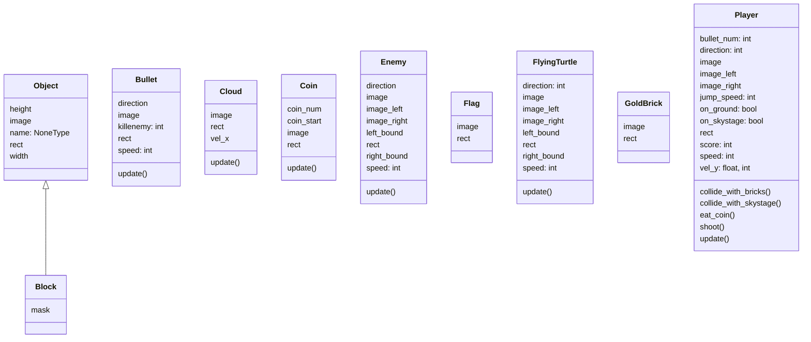

```mermaid
classDiagram
    class Object {
        height
        image
        name: NoneType
        rect
        width
    }

    class Block {
        mask
    }

    class Bullet {
        direction
        image
        killenemy: int
        rect
        speed: int
        update()
    }

    class Cloud {
        image
        rect
        vel_x
        update()
    }

    class Coin {
        coin_num
        coin_start
        image
        rect
        update()
    }

    class Enemy {
        direction
        image
        image_left
        image_right
        left_bound
        rect
        right_bound
        speed: int
        update()
    }

    class Flag {
        image
        rect
    }

    class FlyingTurtle {
        direction: int
        image
        image_left
        image_right
        left_bound
        rect
        right_bound
        speed: int
        update()
    }

    class GoldBrick {
        image
        rect
    }

    class Player {
        bullet_num: int
        direction: int
        image
        image_left
        image_right
        jump_speed: int
        on_ground: bool
        on_skystage: bool
        rect
        score: int
        speed: int
        vel_y: float, int
        collide_with_bricks()
        collide_with_skystage()
        eat_coin()
        shoot()
        update()
    }

    Object <|-- Block
```